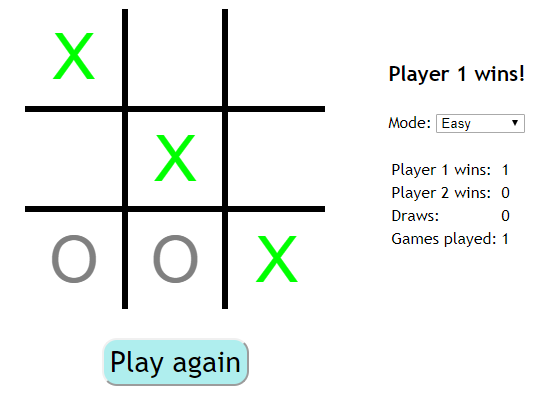

# Tic-tac-toe

Play the classic tic-tac-toe game. Available
[here](https://rory-sullivan.github.io/Tic-tac-toe/).
Two player and single player modes available. Various difficulty levels to play
against.

# About the AIs

A little about the different levels that you can play against and how they work.

## Easy

When playing on easy mode the computer simply plays a random move from any
available move. Since tic-tac-toe is a relatively simple game some times it
gets lucky and plays well but most of the time it is easy to beat.

## Medium

In this mode the computer will try to stop you from completing a line of three
in a row or will complete its own line of three if there is one available.
Otherwise it will play randomly. While it is unlikely that the computer will
win against a human player a reasonable level of skill is required to beat it.

## Hard

This AI plays with a hard coded strategy. In order to make play more
interesting it will randomly select a move from a possible list. For example if
the strategy is to play a corner it will randomly select any available corner.
While the strategy employed is pretty good it is not infallible and there is (at
least one) way to beat it. Can you figure it out?

## Impossible

This AI uses the [minimax algorithm](https://en.wikipedia.org/wiki/Minimax) to
decide on where to play. Since tic-tac-toe is a simple game this results in
perfect play from the AI, playing against it you can only ever lose or draw. As
a result of how the algorithm works the computer will always play the same move
in a given situation, this make for not very interesting game play.
